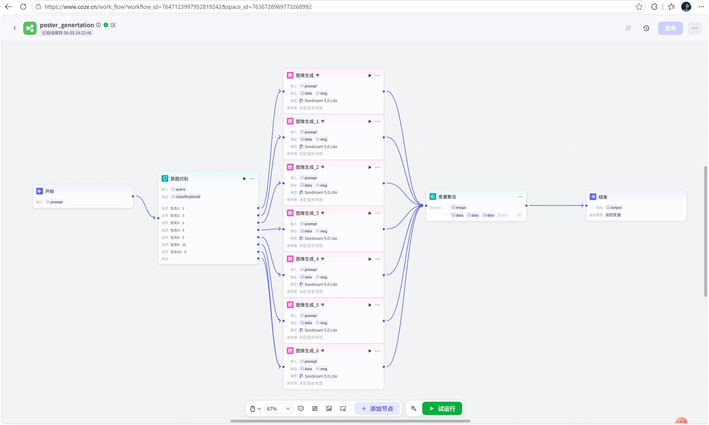

# 人工智能海报生成器（COZE 工作流）

## 📖 项目简介
基于字节跳动 COZE 平台，通过**工作流 + 提示词工程**搭建的智能海报生成工具。用户只需输入自然语言描述（如“科技风、蓝色、招聘海报”），系统自动调用大模型与图像生成节点，输出企业级宣传海报。适用于市场运营快速产出多版本素材。

## 🛠️ 技术实现
- **平台**：COZE（扣子）
- **核心能力**：工作流编排、提示词工程、多模态生成
- **关键节点**：
  1. 用户输入解析节点（提取风格、主题、文案）
  2. 大模型提示词生成节点（扩写为详细绘图指令）
  3. 图像生成节点（调用绘图能力）
  4. 结果输出与格式整理节点

## 🎨 工作流设计截图
<!-- 在这里插入工作流的节点连接截图 -->

## 🖼️ 生成效果示例
<!-- 在这里插入生成的海报示例图 -->

## 🔗 在线体验
[点击体验 COZE 智能体](https://www.coze.cn/user/2209398583732490?access_entrance=my_profile&sub_tab=bots&tab=user_product)

## 💡 项目亮点
- 完全通过低代码工作流实现，无需后端开发
- 1 分钟内生成多版本宣传海报，可快速用于 A/B 测试
- 展现对大模型提示词、工作流编排的深度理解
- 已实际应用于市场活动物料生成，提效明显

## 📌 后续计划
- 优化提示词以支持更多风格（国潮、极简等）
- 接入更多绘图模型进行效果对比
